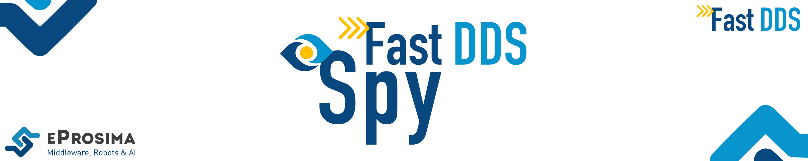

[](https://eprosima.com/middleware/tools/fast-dds-spy)

<br>

<div class="menu" align="center">
    <strong>
        <a href="https://eprosima.com/index.php/downloads-all">Download</a>
        <span>&nbsp;&nbsp;•&nbsp;&nbsp;</span>
        <a href="https://fast-dds-spy.readthedocs.io/en/latest/">Docs</a>
        <span>&nbsp;&nbsp;•&nbsp;&nbsp;</span>
        <a href="https://eprosima.com/index.php/company-all/news">News</a>
        <span>&nbsp;&nbsp;•&nbsp;&nbsp;</span>
        <a href="https://twitter.com/EProsima">Twitter</a>
        <span>&nbsp;&nbsp;•&nbsp;&nbsp;</span>
        <a href="mailto:info@eprosima.com">Contact Us</a>
    </strong>
</div>

<br><br>

<div class="badges" align="center">
    <a href="https://opensource.org/licenses/Apache-2.0"></a>
    <a href="https://github.com/eProsima/Fast-DDS-Spy/releases"></a>
    <a href="https://github.com/eProsima/Fast-DDS-Spy/issues"></a>
    <a href="https://github.com/eProsima/Fast-DDS-Spy/network/members"></a>
    <a href="https://github.com/eProsima/Fast-DDS-Spy/stargazers"></a>
    <br>
    <a href="https://fast-dds-spy.readthedocs.io"></a>
    <a href="https://github.com/eProsima/Fast-DDS-spy/actions/workflows/nightly-windows-ci.yml"></a>
    <a href="https://github.com/eProsima/Fast-DDS-spy/actions/workflows/nightly-ubuntu-ci.yml"></a>
</div>

<br><br>

*eProsima Fast DDS Spy* is a CLI interactive tool that allows to introspect a DDS network in human readable format.
It is possible to query the network about the DomainParticipants connected, their endpoints (DataWriters and DataReaders) and the topics they communicate in.
It is also possible to see the user data sent through network topics in a schematic format in run time.


## Documentation

You can access the documentation online hosted on *Read the Docs*.

* [Introduction](https://fast-dds-spy.readthedocs.io/en/latest/rst/formalia/titlepage.html)
* [Installation Manual](https://fast-dds-spy.readthedocs.io/en/latest/rst/installation/linux.html)
* [User Manual](https://fast-dds-spy.readthedocs.io/en/latest/rst/user_manual/usage_example.html)
* [Developer Manual](https://fast-dds-spy.readthedocs.io/en/latest/rst/developer_manual/installation/sources/linux.html)
* [Release Notes](https://fast-dds-spy.readthedocs.io/en/latest/rst/notes/notes.html)


## Installation Guide

The instructions for installing the *Fast DDS Spy* application from sources and its required dependencies on a Linux
environment are provided below. These installation instructions are a summarized version of the complete
[installation guide](https://fast-dds-spy.readthedocs.io/en/latest/rst/developer_manual/installation/sources/linux.html) available online. Instructions for installing *Fast DDS Spy* on a **Windows** platform can be found
[here](https://fast-dds-spy.readthedocs.io/en/latest/rst/developer_manual/installation/sources/windows.html).

### Requirements

*eProsima Fast DDS Spy* requires the following tools to be installed in the system:
* [CMake](https://cmake.org/), [g++](https://gcc.gnu.org/), [pip](https://pypi.org/project/pip/), [wget](https://www.gnu.org/software/wget/) and [git](https://git-scm.com/)
* [Colcon](https://colcon.readthedocs.io/en/released/) [optional, not required for CMake-only installation]

```bash
# apt packages
sudo apt install -y \
    cmake \
    g++ \
    pip \
    wget \
    git \
    libasio-dev \
    libtinyxml2-dev \
    libssl-dev \
    libyaml-cpp-dev

# python packages
pip3 install -U \
    colcon-common-extensions \
    vcstool
```

### Colcon installation

1. Create a `Fast-DDS-spy` directory and download the `.repos` file that will be used to install *Fast DDS Spy* and its dependencies:

    ```bash
    mkdir -p ~/Fast-DDS-spy/src
    cd ~/Fast-DDS-spy
    wget https://raw.githubusercontent.com/eProsima/Fast-DDS-spy/main/fastddsspy.repos
    vcs import src < fastddsspy.repos
    ```

2. Build the packages:

    ```bash
    colcon build --packages-up-to fastddsspy_tool
    ```

### Run an application

To run the *Fast DDS Spy* application, source the installation environment and execute the executable file that has been
installed in `<install-path>/fastddsspy_tool/bin/fastddsspy`:

```bash
# Source installation
source <install-path>/setup.bash

# Execute Fast DDS Spy
fastddsspy_tool
# Use <fastddsspy_tool --help> to see the tool manual
```

## Getting Help

If you need support you can reach us by mail at `support@eProsima.com` or by phone at `+34 91 804 34 48`.
